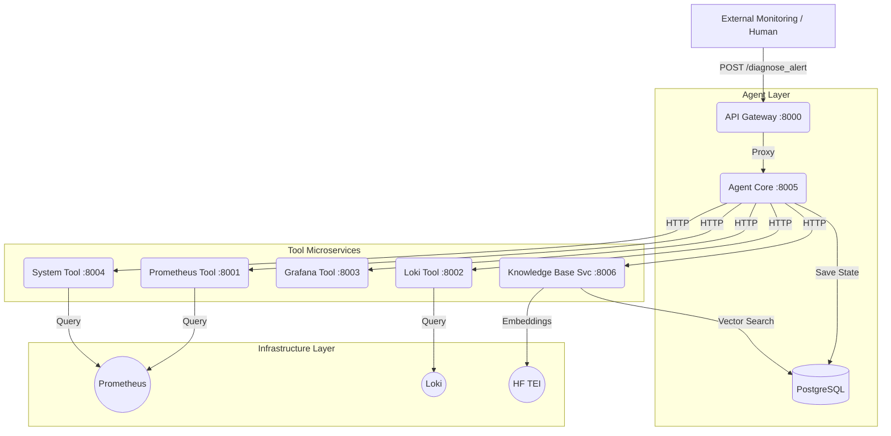
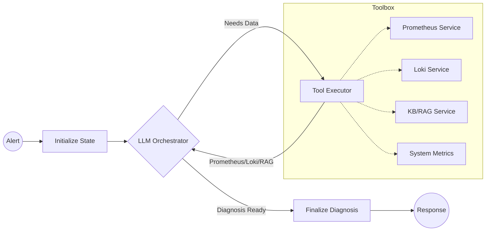

# AI Agents MLOps Course - Chapter 5: Scalable Microservices Architecture

This branch provides the **completed solution** for Chapter 5. It transforms our MLOps Diagnostic Agent from a monolithic design into a modern, decoupled **Microservices Architecture**.

## 🏗️ Architecture Design

### System Overview (Global Architecture)
The platform follows a distributed microservices pattern. External clients interact solely with the API Gateway, which handles orchestration across the specialized services.



### Agent Logic (LangGraph Flow)
Inside the **Agent Core**, a stateful graph manages the diagnostic reasoning process:



## 🌟 Key Chapter 5 Features

- **Decoupling:** Tools are now standalone APIs, making it easier to scale or swap monitoring backends (e.g., swapping Loki for Datadog) without touching the Agent Core.
- **Improved Reliability:** Each service has its own lifecycle and health checks. If one tool service fails, the Agent Core can still function and report partial results.
- **Unified Entry Point:** The API Gateway acts as a proxy, simplifying the interface for external systems like Slack bots or alert managers.
- **Scalability:** Services can be scaled independently based on load. High log search volume? Scale just the Loki Tool Service.

## 🚀 Quick Start (3 Commands)

```bash
# 1. Start the entire Microservices Stack
docker compose up --build -d

# 2. Load sample incidents into the standalone Knowledge Base
docker compose run data-loader

# 3. Test a diagnosis via the API Gateway
curl -X POST http://localhost:8000/diagnose_alert \
  -H "Content-Type: application/json" \
  -d '{
    "alerts": [{
      "labels": {"alertname": "HighMemoryUsage", "service": "news-classifier-api"},
      "annotations": {"summary": "Memory usage > 90% for 15 minutes"},
      "fingerprint": "ch5_test_001"
    }]
  }' | jq
```

## 🧪 Service Verification

You can verify the status of the entire architecture using the provided verification script:

```bash
# Check the health of all 7+ services and run a test diagnosis
python3 verify_microservices.py
```

**What this checks:**
- ✅ **API Gateway** proxying to Agent Core.
- ✅ **Agent Core** reaching Tool Microservices via internal Docker network.
- ✅ **Knowledge Base Service** performing semantic searches.
- ✅ **Monitoring Services** (Prometheus/Loki) connectivity.

## 🛠️ Setup & Configuration

### 1. Git Hooks (Recommended)
If you haven't already, install the git hooks to ensure clean workspace transitions:
```bash
bash scripts/setup-git-hooks.sh
```

### 2. Environment Configuration (`.env`)
Ensure your `.env` file at the root contains your `GROQ_API_KEY`. Chapter 5 uses the following key setting by default:
```env
DEPLOYMENT_MODE="microservices"
ENABLE_RAG_TOOL="true"
```

### 3. Service Observation

- **API Gateway Health**: `http://localhost:8000/health`
- **Agent Core Health**: `http://localhost:8005/health`
- **Knowledge Base Stats**: `http://localhost:8006/stats`
- **Grafana Dashboards**: `http://localhost:3001` (admin/admin)
- **LangSmith Tracing**: [smith.langchain.com](https://smith.langchain.com/)

---
*Created as part of the AI Agents MLOps Course by DataScientest.*
