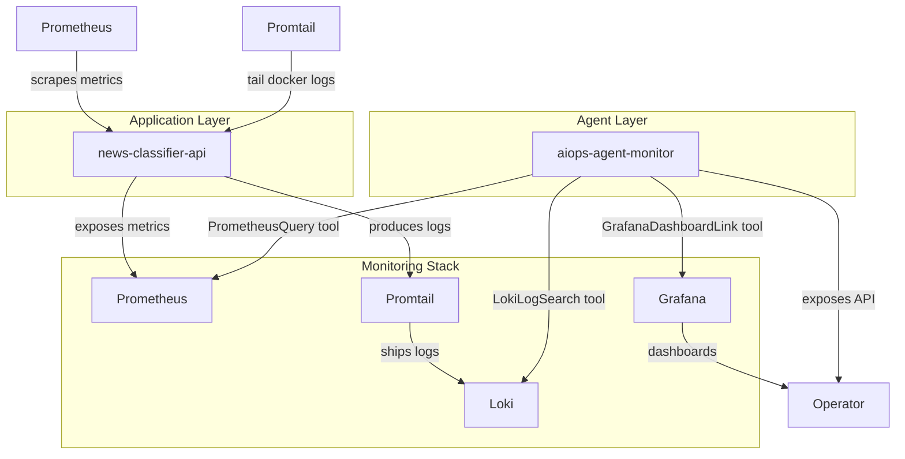
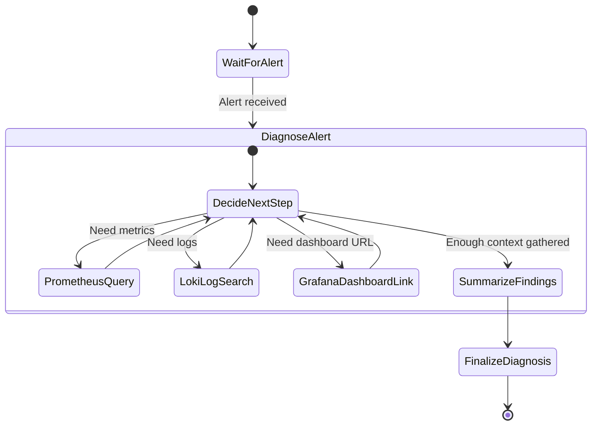
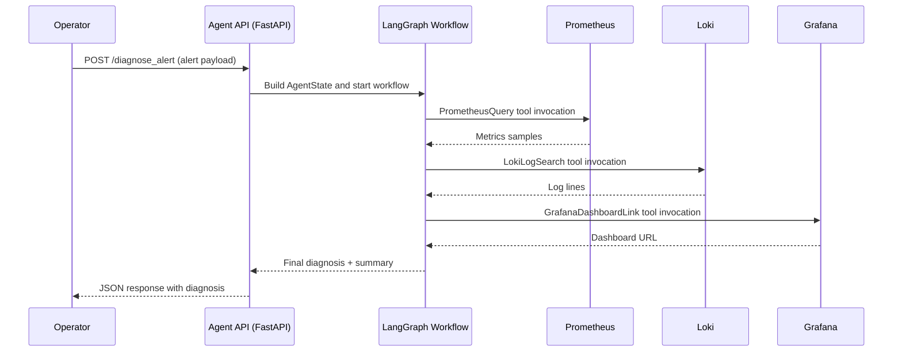

# AI Agents MLOps Course - Chapter 3: Tools & System Integrations

This branch demonstrates how to build production-ready tools for an AI Agent to effectively monitor and diagnose issues within a real-world MLOps architecture (Prometheus, Grafana, Loki).

## Exercise Principle

In Chapter 3, the core challenge is to enable our "MLOps Diagnostic Agent" to interact with live monitoring systems. This solution implements:
-   **A functional MLOps Monitoring Stack:** Deployment of Prometheus (metrics), Grafana (dashboards), Loki (logs), and Promtail (log collection) alongside a simulated `news-classifier-api` (the target system).
-   **Production-Ready LangChain Tools:** Implementation of `PrometheusQueryTool`, `LokiLogSearchTool`, and `GrafanaDashboardLinkTool` (using `@tool` decorator for simplicity and robustness). These tools make HTTP API calls to the deployed monitoring services.
-   **A LangGraph Diagnostic Agent:** The `aiops-agent-monitor-service` (deployed as a Docker container) encapsulates a LangGraph agent. This agent receives simulated alerts, then uses its tools to:
    1.  **Query Prometheus** for relevant metrics (e.g., CPU load of `news-classifier-api`).
    2.  **Search Loki** for application logs (e.g., error messages from `news-classifier-api`).
    3.  **Generate a Grafana Dashboard Link** for visual context.
    4.  **Synthesize a comprehensive diagnosis and propose solutions** using a Large Language Model (LLM).
-   **Full Observability:** The entire stack, including the `aiops-agent-monitor-service` itself, is monitored by Prometheus and Loki. Agent activity (API requests, LLM calls, tool executions) is visible in Grafana and traced in LangSmith.

The goal is to demonstrate the practical integration of AI agents with AIOps tools, showing how an agent perceives and acts upon real-time operational data.

## How to Set Up and Run the Solution

This project uses Docker Compose for service orchestration and a `Makefile` for simplified commands.

### 1. Prerequisites

*   **Groq API Key:** Obtain a key from [Groq Cloud](https://console.groq.com/keys) and add it to your `.env` file.
*   **LangSmith API Key (Essential for observability):** Obtain a key from [LangSmith](https://smith.langchain.com/) and add it to your `.env` file.
*   **Docker & Docker Compose:** Essential for deploying the entire AIOps stack.

### 2. Setup (`.env` file)

Create a `.env` file at the root of the project. **Make sure your `GROQ_API_KEY` is correct.**

```
GROQ_API_KEY="your_groq_api_key_here"
LANGCHAIN_TRACING_V2="true"
LANGCHAIN_API_KEY="your_langsmith_api_key_here"
LANGCHAIN_PROJECT="MLOps Guard Agent - Chapter 3"
```


### 3. Deploy the AIOps Stack

This command will build the Docker images for your `news-classifier-api` and `aiops-agent-monitor-service`, and then deploy the entire monitoring stack along with these services.

*   **From the project root, simply run:**
    ```bash
    make
    ```
    Verify all containers are running: `docker compose ps`.

### 4. Interact and Observe the Solution

Now, you can interact with the system and observe the agent's behavior.

## System Architecture Overview



### Service Responsibilities

- **news-classifier-api** — Simulated inference API generating metrics and logs so the monitoring stack has realistic data to ingest.
- **aiops-agent-monitor** — LangGraph-powered diagnostic agent. Receives alerts, calls the monitoring tools, and produces remediation guidance.
- **Prometheus** — Collects metrics from the API and the agent container.
- **Loki** — Stores logs shipped by Promtail; queried by the agent through the Loki tool.
- **Promtail** — Harvests container logs and forwards them to Loki with `job`/`service` labels.
- **Grafana** — Renders dashboards for metrics and exposes an Explore view for Loki queries.
- **Node Exporter** — Provides host-level metrics Prometheus can scrape.

## LangGraph Agent Flow



## Operational Scenarios

*   **Access Monitoring Dashboards (Grafana)**
    Open your browser and navigate to `http://localhost:3000` (admin/admin).
    -   Explore the "API Dashboard" to see metrics from the api service.
    -   Explore the "Model Dashboard" to see metrics from the model.
    -   Explore the "AIOps Monitor Agent Health Dashboard" to see the agent's own performance metrics (API requests, latency) and its logs.

*   **Trigger the AI Agent with an Alert**
    This simulates AlertManager sending an alert to our AI Agent. The agent will then diagnose the issue using its tools.
    ```bash
    make trigger-alert-critical
    ```
    You should see a JSON response in your terminal, which is the agent's diagnostic output.

    What happens:
    1. The `news-classifier-api` emits an Alertmanager-style payload describing a critical CPU spike.
    2. The `aiops-agent-monitor` service receives `/diagnose_alert`, spins up the LangGraph workflow, and consults Prometheus/Loki/Grafana via its tools.
    3. The agent returns a structured diagnosis with likely causes, mitigations, and follow-up recommendations.

*   **Observe Agent Logs (Docker)**
    Watch the agent's live diagnostic process:
    ```bash
    docker logs aiops-agent-monitor-service
    ```
    You will see the agent receiving the alert, invoking LLM for decisions, calling `PrometheusQueryTool`, `LokiLogSearchTool`, `GrafanaDashboardLinkTool`, and finally formulating a detailed diagnosis.

*   **Summarize the Agent’s Latest Actions**
    ```bash
    make show-agent-steps
    ```
    This helper aggregates the last ten minutes of agent logs into a concise JSON timeline. Expect entries such as `tool_call` (Prometheus, Loki, Grafana), `decision_tool`, and `diagnosis_complete`, giving operators a quick replay of how the agent reasoned about the latest alert.

## Alert Handling Flow



The `make trigger-alert-critical` command emulates Alertmanager by posting directly to the agent's FastAPI endpoint. The agent never calls the `news-classifier-api` application service directly; instead, it consumes the same telemetry (Prometheus metrics, Loki logs, Grafana dashboards) that operators use. This decoupled pattern is standard observability practice: the monitored workload exports telemetry, and diagnostic or remediation agents reason over that telemetry without impacting the production traffic path.

### 5. Management Commands

*   **Stop monitoring stack and services:**
    ```bash
    make stop
    ```
